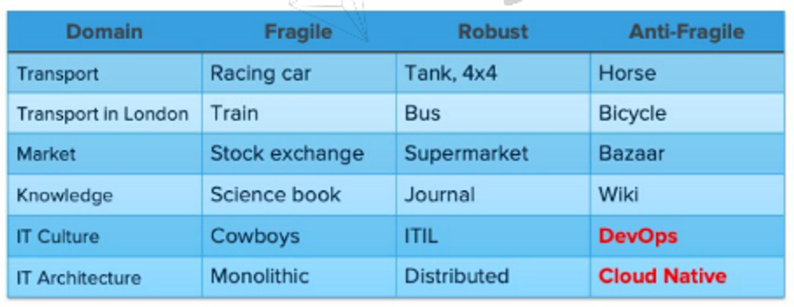
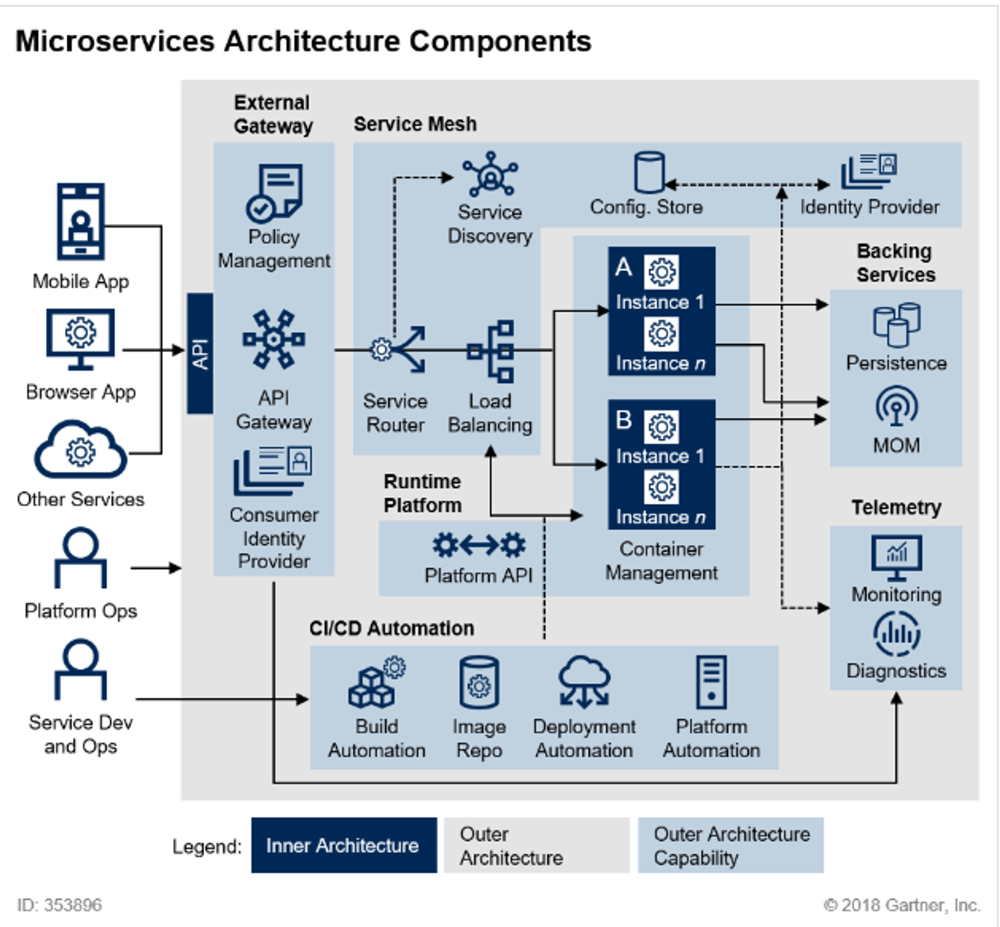
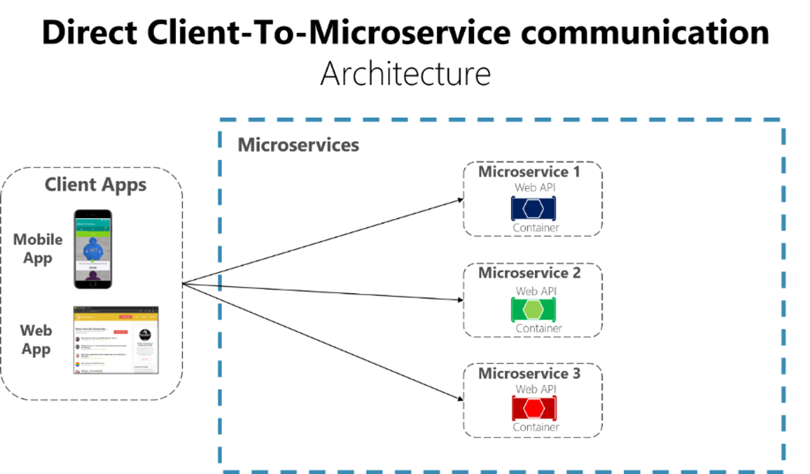
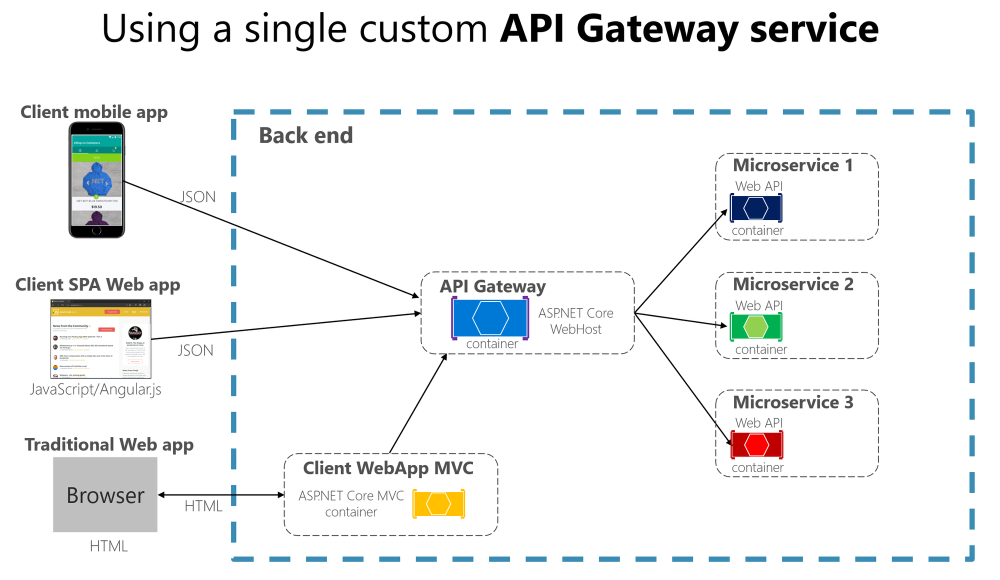

### Cloud Native

- 클라우드 제공 모델에서 제공하는 분산 컴퓨팅을 활용해 애플리케이션을 구축 및 실행하는 개념을 의미한다.
- 확장성, 탄력성, 복원성, 유연성을 활용하도록 설계 및 구축되었다.
- 탄력적이고 관리 가능하며 관찰 가능한 느슨하게 결합된 시스템을 사용할 수 있도록 해준다.

### Software Architecture History



### AntiFragile (Cloud Native Architecture)

- Auto scaling
- Microservices
- Chaos engineering
- Continuous deployments

### Cloud Native Architecture

- 확장 가능한 아키텍처
- 탄력적 아키텍처
- 장애 격리

# Cloud Native Application

### 1. Microserivces

### 2. CI/CD

CI (Continuous Integration)

- 통합된 코드를 빌드하고 테스트하는 행위
- ex) Jenkins, Travis CI

CD (Continuous Deployment)

- 패키징된 실행 파일을 실행 환경에 자동 반영되는 것

### 3. DevOps

- Development + Operations

### 4. Containers

- Cloud Native에서 컨테이너 가상화 기술은 필수적

# What is the Microservice?

- single application as a suite of small services

# MSA Architecture



### Service Mesh

- 서비스 메시는 MSA를 적용한 시스템 내부 통신을 담당하는 네트워크 계층 (하나의 서비스가 아닌 추상적인 개념)
- 마이크로 서비스 구성 요소간 상호 통신을 위해서는 Service Discovery, Service Routing, Failure recovery, Load Balancing, Security 등의 문제를 처리할 수 있는 메커니즘 등을 포함

API Gateway는 노출되는 부분(External)에 위치하여 내부 서비스 보호 및 제어, Service Mesh는 내부 서비스(Internal)에 위치하여 서비스를 관리하는 구조로 많이 사용된다.

# Spring Cloud

- `Centralized configuration management`
    - Spring Cloud Config Server
    - 환경설정을 외부로 빼둠으로써 유지보수 향상
- `Location transparency`
    - Service Registration, Service Discovery
    - Naming Server(Eureka)
- `Load Distribution(Load Balancing)`
    - Spring Cloud Gateway
- `Easier REST Clients`
    - FeignClient
- `Visibility and monitoring`
    - ELK
- `Fault Tolerance(내결함성)`
    - 하나 이상의 오류가 발생하는 경우에도 시스템이 계속 제대로 작동할 수 있도록 하는 속성
    - Hystrix

# Spring Cloud Netflix Eureka

- 넷플릭스가 가지고 있는 자사의 클라우드 기술을 자바 스프링 재단에 기부해서 사용할 수 있는게 Eureka
- 서비스 등록 & 검색과 관련된 작업 수행

### Eureka Server (application.yml)

```yaml
server:
  port: 8761

spring:
  application:
    name: discoveryservice

eureka:
  client:
    register-with-eureka: false
    - Eureka 서버에 자신을 등록할지 여부를 결정
    fetch-registry: false
    - Eureka 서버로부터 다른 서비스의 레지스트리를 가져올지 여부를 결정
```

- Eureka 서버의 기본 포트는 8761이며, 이 포트에서 Eureka 대시보드와 API 제공
- register-with-eureka
    - Eureka 서버는 자기 자신을 등록할 필요가 없음
- fetch-registry
    - 다른 Eureka 서버에서 서비스 레지스트리를 가져오지 않음

### Eureka Client (application.yml)

```yaml
server:
  port: 9001

spring:
  application:
    name: user-service

eureka:
  client:
    register-with-eureka: true
    fetch-registry: true
    # 서비스 위치가 어디인지 나타내는 항목
    service-url:
      defaultZone: http://127.0.0.1:8761/eureka # Eureka 클라이언트가 연결할 Eureka 서버 URL
```

- server: port: 0
    - 랜덤 포트를 사용하겠다는 의미

port:0으로 설정하게 되면, 대시보드에서는 yaml 파일을 기준으로 보여지기 때문에 가동된 서비스 갯수가 늘지않는다. 그래서 instance-id 옵션을 준다.

# API Gateway



API Gateway가 없는 경우, 새로운 MS가 추가되거나, 서비스 주소가 변경되거나, 파라미터 인자값이 변경될 때 Client Side도 같이 수정 배포가 되어야 한다.



그래서 모든 request를 일괄적으로 처리할 수 있는, 단일 진입점을 이용한 개발이 필요하게 되었다. 

# Spring Cloud에서의 MSA간 통신

- RestTemplate
- Feign Client

### Netflix Ribbon: Client side Load Balancer

- 서비스 이름으로만 호출할 수 있는 장점이 있음, Client Side에서 동작한다.
- 비동기 처리 방식을 지원하지 않아 최근에는 사용되지 않고 있다.

### Netflix Zuul

- API Gateway 역할과 동일한 작업 수행